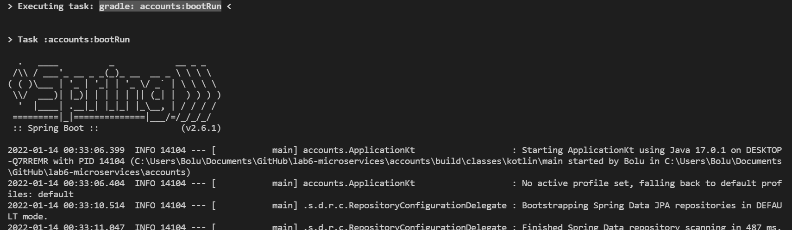
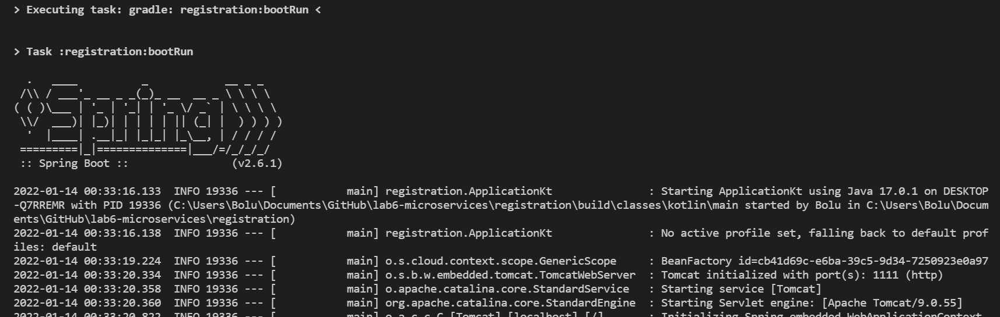
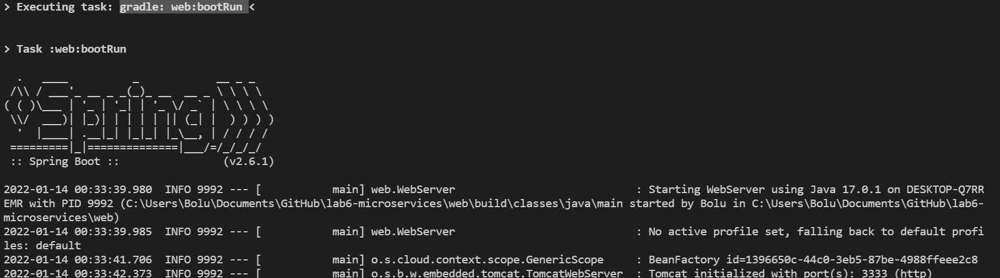
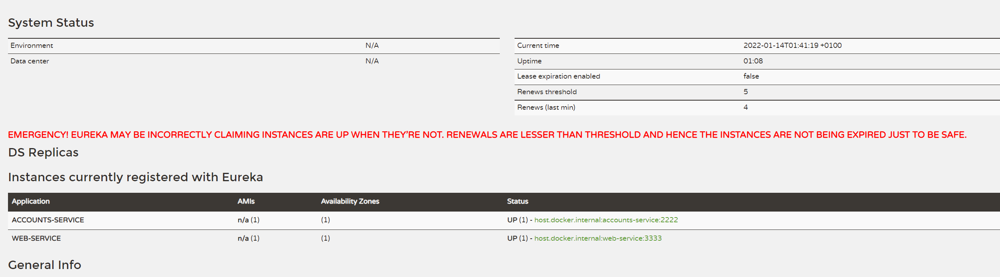
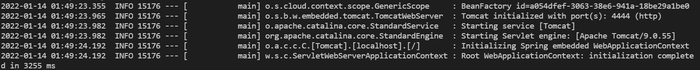
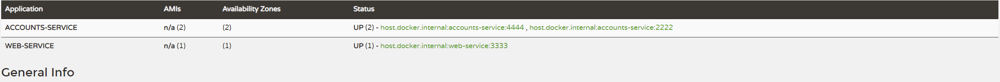
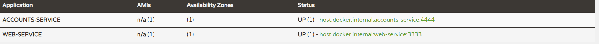
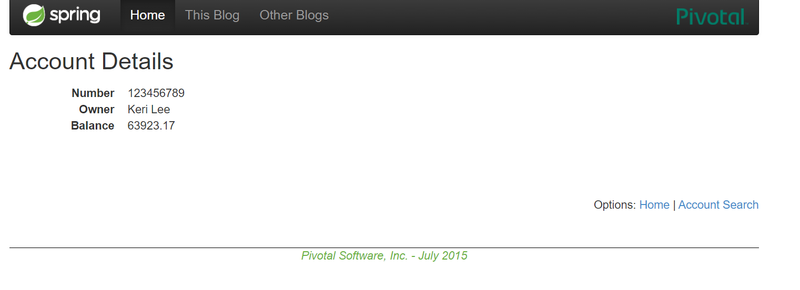

#Run applications


First we bootRun acconts,registration and web,i use a plugin of Visual Studio Code but you can use these commands:
```
./gradlew accounts:bootRun
./gradlew registration:bootRun
./gradlew web:bootRun 
```




Now you can see in `localhost:1111` in the Web Service it register both services.



You can add new account service modyfing `application.yml` the default port of account into `4444` then start a new instance of 
account 


Check if its added the new Instance


Now lets kill the old one with Ctrl+C in the terminal,we can see the instance is deleted from the web service


If we tried to access to the killed service from port `2222` we gonna get redirected to accounts `4444`


